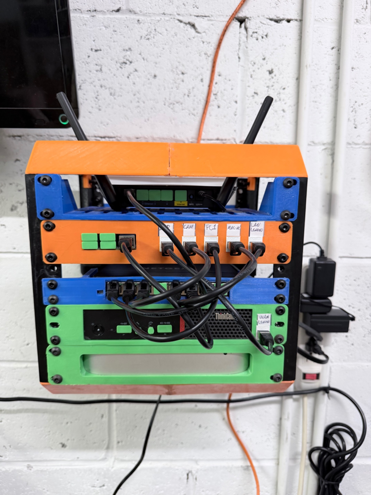
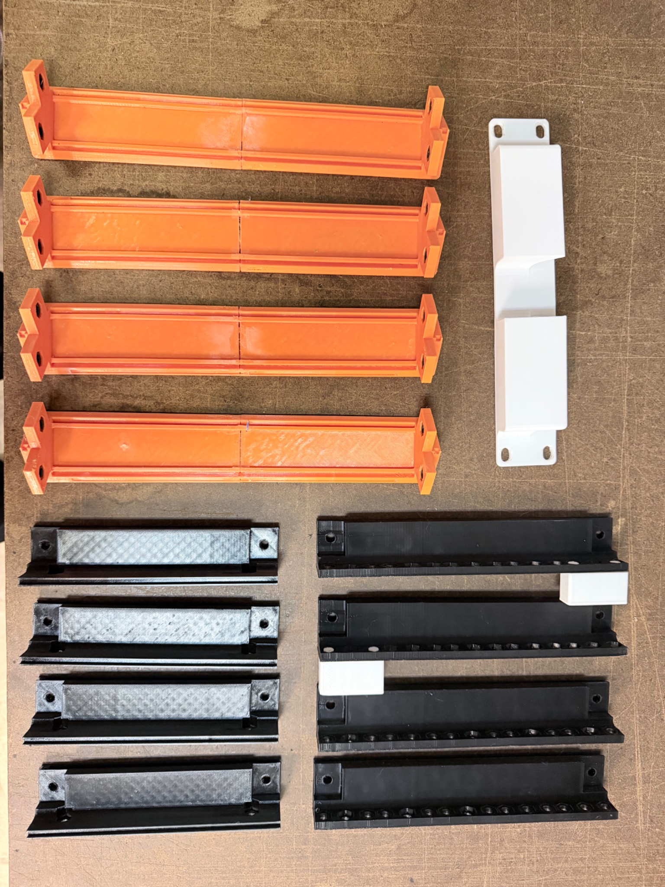
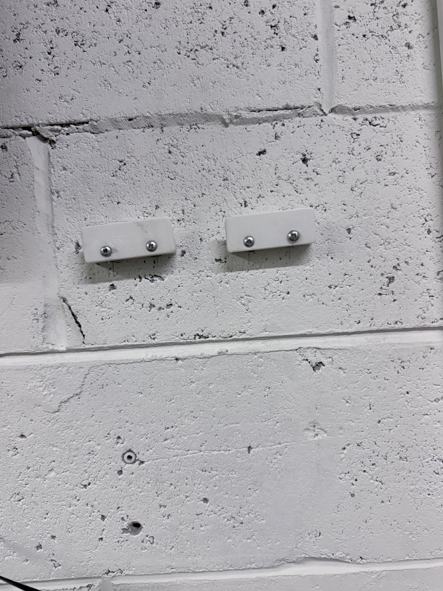
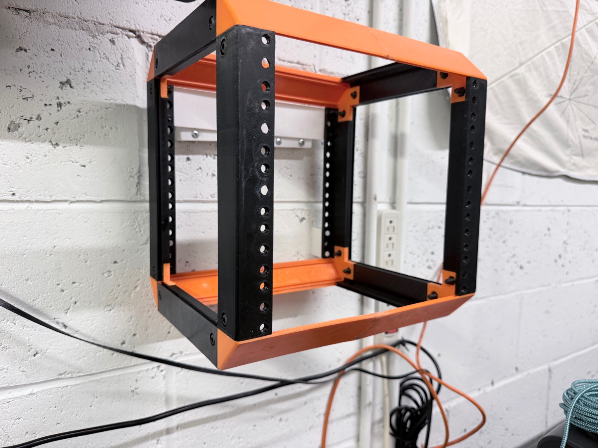
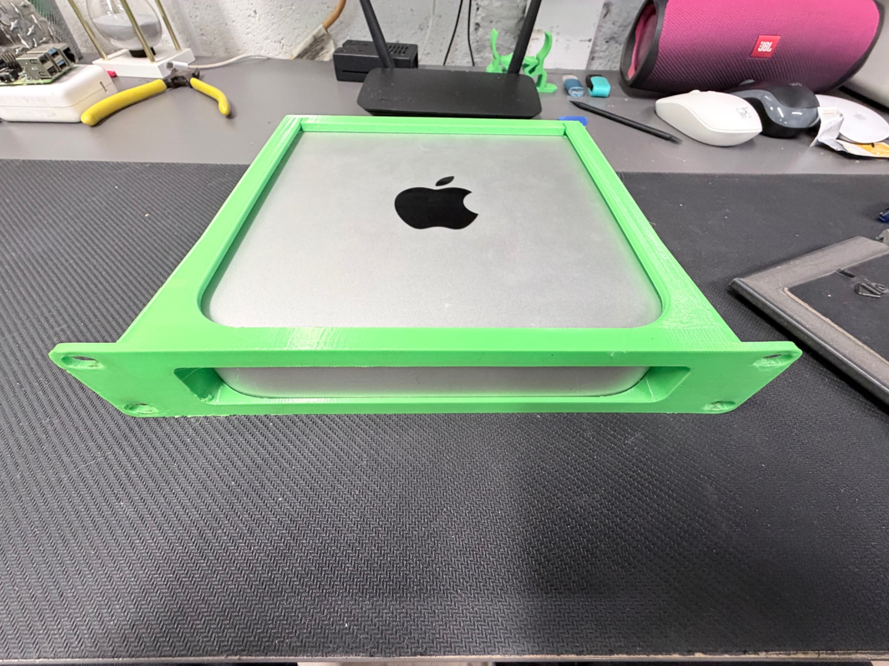
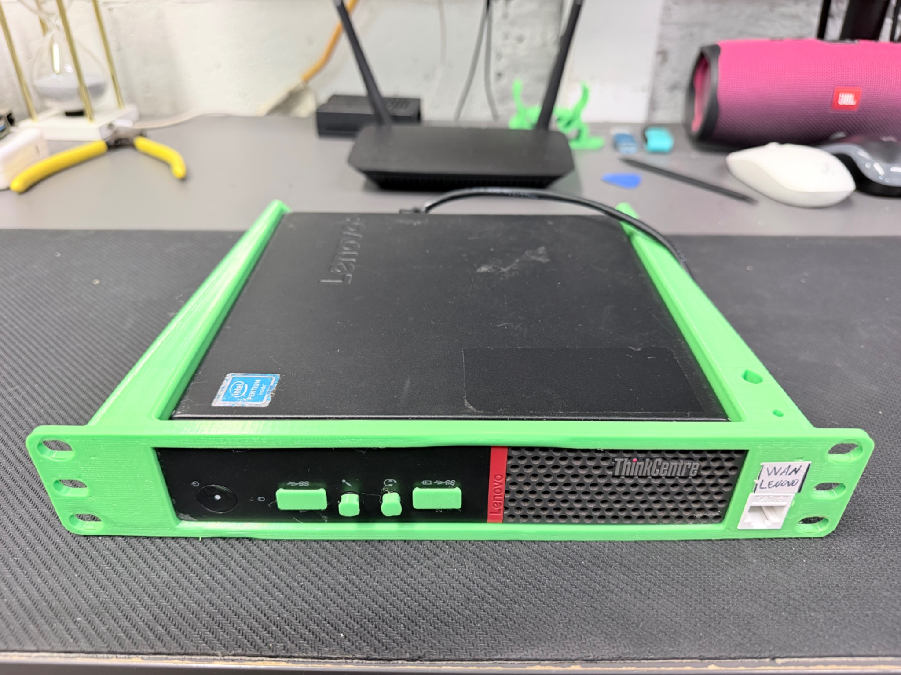
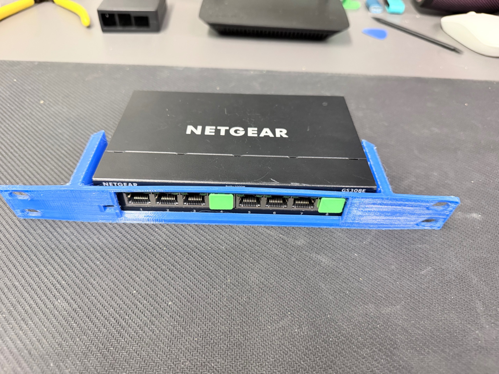
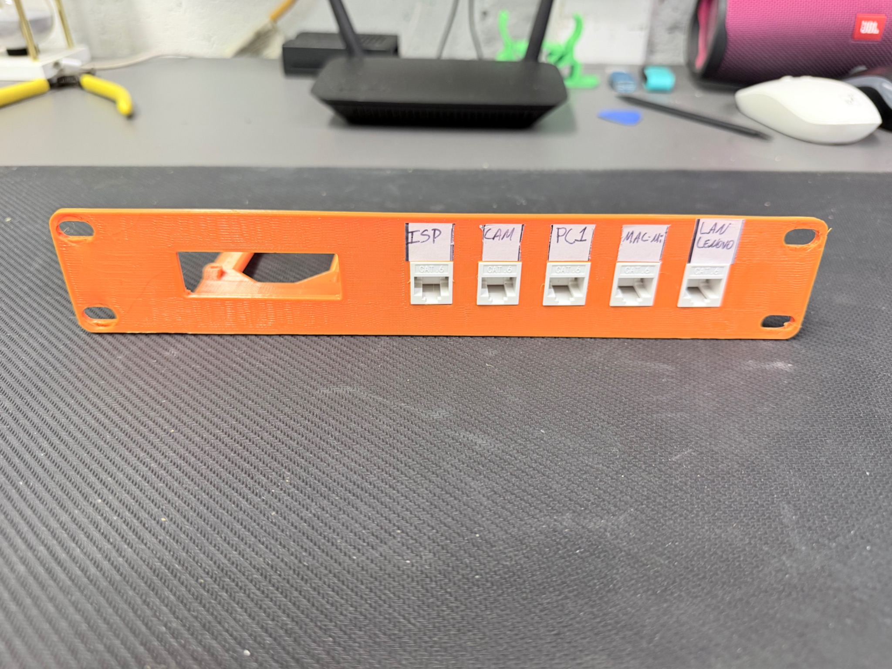
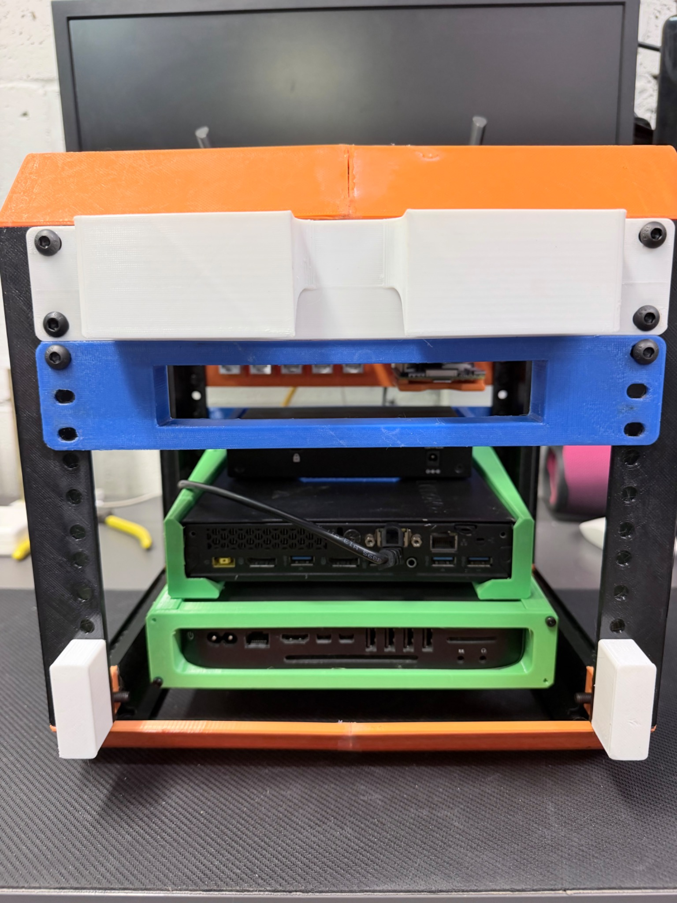

# Homelab Physical Infrastructure

Design, fabrication, and assembly of a custom **10-inch 5U homelab rack** built with PETG 3D-printed components and repurposed small-form-factor hardware.

This project documents the physical foundation of my homelab from the initial rack design and hardware selection through 3D printing, wall mounting, equipment installation, structured cabling, and final assembly.

<p align="center">
  
</p>

<p align="center">
  <em>Completed 10-inch 5U homelab rack with structured cabling, managed switching, compute hardware, Raspberry Pi infrastructure, and wireless networking.</em>
</p>

---

## Overview

The goal of this project was to create a compact and serviceable infrastructure platform without purchasing a traditional full-size server rack.

Most of the equipment I already owned—including the Mac mini, Lenovo ThinkCentre Tiny, Raspberry Pi, managed switch, and wireless hardware—was not designed for standard rack installation.

Rather than replacing the equipment, I built the physical infrastructure around it.

The solution uses a **10-inch 5U rack system** with custom and community-designed 3D-printed components to integrate the equipment into one organized platform.

This repository documents both:

* **What I built**
* **How someone else can reproduce or adapt the build**

---

## Project Objectives

The physical infrastructure was designed around several requirements:

* Compact footprint
* 10-inch rack format
* Approximately 5U of equipment capacity
* Modular construction
* Front-accessible network connections
* Support for non-rackmount hardware
* Structured Ethernet cabling
* Easy equipment removal and maintenance
* Adequate ventilation
* Wall-mount capability
* Low-cost use of existing hardware
* Future expansion

---

## What I Built

The completed rack integrates:

| Component                   | Role                                                   |
| --------------------------- | ------------------------------------------------------ |
| **Lenovo ThinkCentre Tiny** | Dedicated network infrastructure / firewall platform   |
| **Apple Mac mini**          | Server, storage, NAS, and application-hosting platform |
| **Raspberry Pi 4**          | Low-power network and infrastructure services          |
| **NETGEAR GS308E**          | Managed Ethernet switching                             |
| **Keystone Patch Panel**    | Structured front-facing Ethernet connections           |
| **Wireless Device**         | Wireless network connectivity                          |
| **10-inch 5U Rack**         | Physical infrastructure platform                       |

The individual devices will be configured and documented in separate homelab projects.

This repository focuses specifically on the **physical infrastructure layer**.

---

## Rack Layout

The final equipment layout is approximately:

```text
┌────────────────────────────────────┐
│       Wireless / Upper Shelf       │
├────────────────────────────────────┤
│    Raspberry Pi + Patch Panel      │
├────────────────────────────────────┤
│      NETGEAR Managed Switch        │
├────────────────────────────────────┤
│       Lenovo ThinkCentre Tiny      │
├────────────────────────────────────┤
│            Mac mini                │
└────────────────────────────────────┘
```

The layout was designed around:

* Equipment accessibility
* Cable management
* Port visibility
* Cooling
* Serviceability
* Weight distribution
* Future changes

---

## Build Process

The physical infrastructure was completed in several stages.

### 1. Hardware Inventory

Before printing anything, I identified the equipment that needed to fit inside the rack.

This included measuring and verifying:

* Device width
* Device height
* Device depth
* Ethernet port locations
* Power connections
* USB connections
* Ventilation
* Cable clearance

---

### 2. 3D Model Research

Rather than designing every rack component from scratch, I researched existing community-created models from platforms including:

* MakerWorld
* Printables
* Thingiverse

Models were selected based on compatibility with the hardware being installed.

Each model source and original creator is documented in the:

**[3D Printing Guide](docs/printing-guide.md)**

---

### 3. Rack Fabrication

The rack structure and device adapters were 3D printed primarily using **PETG**.

Printed components included:

* 10-inch rack structure
* Equipment rails and supports
* Mac mini mount
* Lenovo ThinkCentre mount
* NETGEAR switch mount
* Raspberry Pi / keystone panel
* 1U shelf
* French cleat mounting components



*Printed rack components prepared before assembly.*

---

### 4. Wall Mounting

A French cleat mounting system was used to attach the rack to the wall while allowing it to remain removable for future maintenance.



*Wall-side French cleat mounting components.*



*Assembled rack mounted before equipment installation.*

---

### 5. Hardware Integration

Each non-rackmount device was installed using a dedicated 3D-printed adapter.

The design preserves access to:

* Power connections
* Ethernet interfaces
* USB ports
* Display connections
* Ventilation
* Maintenance access

#### Mac mini



*Mac mini installed in its 10-inch rack adapter.*

#### Lenovo ThinkCentre



*Lenovo ThinkCentre installed in its custom rack mount.*

#### NETGEAR Managed Switch



*NETGEAR GS308E installed with front-facing Ethernet ports.*

---

## Structured Cabling

One of the goals of the project was to make the network connections accessible from the front of the rack.

A custom panel combines:

* Raspberry Pi mounting
* Five RJ45 keystone connections



This allows connections such as:

```text
WAN
LAN
SERVER
CLIENT
CAMERA
```

to be clearly labeled and routed through the rack.

The exact labels can be changed based on the network being built.

Structured cabling makes it easier to:

* Trace connections
* Troubleshoot networking problems
* Replace equipment
* Change switch ports
* Document the environment
* Maintain the rack over time

---

## Serviceability

A compact rack is only useful if the hardware can still be maintained.

The mounts were selected and installed to preserve access to device connections.



*Rear view showing access to installed equipment and available spacing.*

The design considers:

* Rear port access
* Power cable access
* Ethernet cable access
* Equipment removal
* Ventilation
* Cable strain
* Maintenance

---

## Final Cabling

Once the hardware was installed, Ethernet connections were routed between the keystone panel, managed switch, and infrastructure devices.


*Completed rack with installed hardware and network cabling.*

The rack now provides a centralized physical platform for the networking and server projects that follow.

---

## Documentation

Detailed build documentation is available below.

### [Parts List](docs/parts-list.md)

Hardware, networking equipment, mounting hardware, tools, and possible equipment substitutions.

### [3D Printing Guide](docs/printing-guide.md)

Original model sources, creator attribution, model-selection process, compatibility considerations, and licensing guidance.

### [Rack Assembly Guide](docs/assembly-guide.md)

Step-by-step physical assembly, wall mounting, hardware installation, labeling, cabling, airflow checks, and final inspection.

---

## Build It Yourself

This project is designed to be adaptable.

You **do not need the exact same hardware** to build a similar rack.

A general workflow is:

```text
Inventory Existing Hardware
        ↓
Measure Equipment
        ↓
Select Rack Size
        ↓
Search for Compatible Mounts
        ↓
Verify Model Compatibility
        ↓
Print Components
        ↓
Test Fit Hardware
        ↓
Assemble Rack
        ↓
Install Equipment
        ↓
Label Connections
        ↓
Route Cabling
        ↓
Validate Airflow
        ↓
Begin Network Configuration
```

Alternative mini PCs, managed switches, Raspberry Pi models, servers, and wireless devices can be used as long as their physical dimensions and mounting requirements are considered.

---

## Key Design Decisions

### Reuse Existing Hardware

Instead of purchasing dedicated enterprise rackmount equipment, existing small-form-factor hardware was repurposed.

This reduced the cost of the project while providing an opportunity to work with:

* Hardware compatibility
* Physical infrastructure planning
* Equipment adaptation
* Resource constraints

### Use a 10-Inch Rack

A traditional 19-inch rack was larger than necessary for the equipment being used.

The 10-inch format provided:

* Smaller footprint
* Lower material usage
* Easier wall mounting
* Sufficient capacity for the current environment

### Use 3D-Printed Mounts

Most of the equipment was never designed for rack installation.

3D printing made it possible to adapt:

* Consumer hardware
* Mini PCs
* Networking equipment
* Raspberry Pi hardware

into a standardized rack structure.

### Use Front-Facing Connections

Frequently accessed Ethernet connections were brought to the front of the rack using keystone jacks.

This improves:

* Accessibility
* Troubleshooting
* Cable tracing
* Documentation
* Serviceability

---

## Skills Demonstrated

This project demonstrates hands-on experience with:

* Physical infrastructure planning
* Homelab architecture
* Hardware inventory and compatibility research
* Small-form-factor server deployment
* Network equipment integration
* Managed switching hardware
* Structured cabling
* RJ45 keystone infrastructure
* Equipment labeling
* Cable management
* Hardware troubleshooting
* Airflow and serviceability planning
* 3D printing
* Rapid prototyping
* PETG fabrication
* Technical research
* Technical documentation
* Build reproducibility
* Project organization
* Equipment reuse and cost-conscious design

---

## Lessons From the Build

Building the physical infrastructure before configuring the network made several issues easier to identify early.

Important considerations included:

* Port accessibility matters as much as device dimensions.
* Power cables require more clearance than expected.
* Compact equipment still requires ventilation.
* Front-facing connections significantly improve serviceability.
* Testing equipment fit before final installation prevents unnecessary rework.
* Labeling connections before cabling makes later troubleshooting easier.
* Existing hardware can often be repurposed effectively instead of replaced.

---

## Project Structure

```text
homelab-physical-infrastructure/
│
├── README.md
│
├── docs/
│   ├── assembly-guide.md
│   ├── parts-list.md
│   └── printing-guide.md
│
└── images/
    ├── rack construction
    ├── hardware installation
    ├── equipment mounts
    └── completed build
```

---

## Project Status

**Physical Infrastructure: Complete ✅**

The rack has been:

* Designed
* Printed
* Assembled
* Wall mounted
* Populated with equipment
* Labeled
* Networked
* Physically validated

The physical infrastructure now serves as the foundation for the remaining homelab projects.

---

## Next Phase

The next project focuses on turning this physical rack into an operational network infrastructure environment.

Topics will include:

* Firewall/router deployment
* Managed switch configuration
* VLAN segmentation
* DHCP
* DNS
* Inter-VLAN routing
* Firewall policies
* Network validation
* Troubleshooting

The networking implementation will be documented separately so that each major part of the homelab can be reviewed and reproduced independently.

---

## Disclaimer

This is a personal homelab and learning environment.

Hardware models, physical layouts, and network requirements will vary between environments. Always verify equipment compatibility, electrical requirements, cooling, structural mounting requirements, and 3D-model licensing before reproducing any part of this build.

Third-party 3D models referenced in this repository remain the property of their respective creators and are linked to their original distribution pages.
